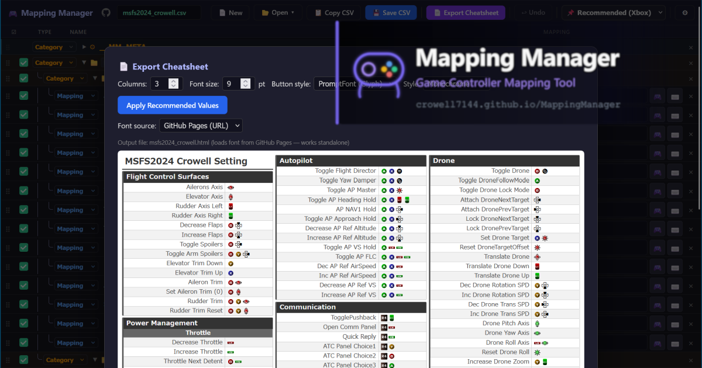

# Mapping Manager



[日本語はこちら / Japanese](#mapping-manager-ja)

A web app for managing game controller mappings and exporting cheat sheets.

**GitHub Pages (live demo)**: https://crowell7144.github.io/MappingManager/

---

## Features

- Organize mappings with categories and sub-categories
- Button display for Xbox / PS4 / PS5 / Nintendo Switch
- Assign mappings via controller input or keyboard input modal
- Save and load data in CSV format
- Copy current data to clipboard as CSV with one click
- Share mappings via GitHub Gist URL (no account required to receive)
- Export cheat sheet as HTML (print-ready — use the browser's "Print → Save as PDF" to generate a PDF)
- Auto-save to LocalStorage
- Japanese / English UI (language-appropriate tutorial shown on first launch)

---

## Sharing Cheat Sheets via Gist

You can share your cheat sheet as a permanent URL — the recipient needs no GitHub account to view it.

**Demo:** https://crowell7144.github.io/MappingManager/?gist=702366383f76a86798859d560e3b2f28&share=1

1. Click **📋 Copy CSV** to copy your current data to the clipboard
2. Go to [gist.github.com](https://gist.github.com), paste the CSV, and click **Create Gist** (a GitHub account is required to create a Gist)
3. In Mapping Manager, click **📂 Open → Load from Gist** and enter the Gist URL
4. A shareable URL will appear in the success dialog — send it to anyone

The recipient opens the URL and sees the cheat sheet in full-screen view. They can also click the **🎮 Edit in Mapping Manager** link at the bottom to return to the editor.

---

## CSV Format

```
id,parentId,type,name,mapping,exclude
1,,category,Category Name,,0
2,1,mapping,Action Name,[A],0
```

| Field | Description |
|-------|-------------|
| `id` | Unique integer ID |
| `parentId` | ID of the parent category (empty for root items) |
| `type` | `category` / `mapping` / `separator` / `pagebreak` |
| `name` | Display name |
| `mapping` | Combination of `[ButtonName]` and/or `{KeyName}` tokens |
| `exclude` | Set to `1` to exclude from cheat sheet output |

---

## Converting MSFS 2024 Controller XML to CSV

The included `msfs_xml2csv.py` script converts controller mapping XML files exported from Microsoft Flight Simulator 2024 into CSV files compatible with Mapping Manager.

### Requirements

- Python 3.8+
- No additional packages required (standard library only)

### Usage

```bash
python msfs_xml2csv.py <xml_file> [xml_file2 ...] [options]
```

**Options:**

| Option | Description |
|--------|-------------|
| `-o FILE` | Output CSV filename (default: first XML filename with `.csv` extension) |
| `--all` | Include unassigned actions in the output |

### Examples

```bash
# Convert a single file
python msfs_xml2csv.py "Gamepad 2024 Planes.xml"

# Merge multiple XML files into one CSV
python msfs_xml2csv.py "Gamepad 2024 Planes.xml" "Gamepad 2024 Transversal.xml"

# Specify output filename
python msfs_xml2csv.py "Gamepad 2024 Planes.xml" -o my_mappings.csv

# Include unassigned actions
python msfs_xml2csv.py "Gamepad 2024 Planes.xml" --all
```

The generated CSV can be loaded directly via the **📂 Open** menu in Mapping Manager.

---

## Claude Code Skill: Generate Shortcuts CSV *(experimental)*

> Requires [Claude Code](https://claude.ai/code). Output is AI-generated and may contain inaccuracies — review before use.

`.claude/commands/generate-shortcuts.md` provides a `/generate-shortcuts` slash command that generates Mapping Manager-compatible CSV files from keyboard shortcut data.

**Usage:**

```
/generate-shortcuts vim                        # generate common vim shortcuts
/generate-shortcuts ~/.vimrc                   # extract mappings from your vimrc
/generate-shortcuts ~/.config/nvim/init.lua    # Neovim Lua config
```

To use outside this project, symlink to your global commands directory:

```bash
ln -s /path/to/MappingManager/.claude/commands/generate-shortcuts.md ~/.claude/commands/generate-shortcuts.md
```

---

## Running Locally

This app uses `fetch()` to load sample CSV files, so it cannot be opened directly via the `file://` protocol.
Please start a local web server instead.

### Python (recommended)

The repository includes `serve.py`, which disables caching for easier development:

```bash
python serve.py
```

Or use the standard `http.server` (browser-side caching may apply):

```bash
python -m http.server 8080
```

Then open http://localhost:8080 in your browser.

### Node.js

```bash
npx serve .
```

---

## Adding Sample Files

1. Add CSV files to `samples/`
2. Register the entry in `samples/samples_index.json`

Use a plain string for `name` and `file` if the sample is language-agnostic, or an object with `ja`/`en` keys to provide per-language names or files:

```json
{
  "samples": [
    {
      "id": "my_sample",
      "name": { "ja": "マイサンプル", "en": "My Sample" },
      "file": "samples/my_sample.csv"
    },
    {
      "id": "my_sample_bilingual",
      "name": { "ja": "バイリンガルサンプル", "en": "Bilingual Sample" },
      "file": { "ja": "samples/my_sample_ja.csv", "en": "samples/my_sample_en.csv" }
    }
  ]
}
```

---

## License

MIT License — see [LICENSE](LICENSE)

PromptFont by Yukari "Shinmera" Hafner — [SIL Open Font License 1.1](PromptFont_LICENSE.txt)

---

<a name="mapping-manager-ja"></a>

# Mapping Manager

[Back to English](#mapping-manager)

ゲームのコントローラーマッピングを管理・チートシート出力するWebアプリです。

**GitHub Pages**: https://crowell7144.github.io/MappingManager/

---

## 機能

- カテゴリ・サブカテゴリによるマッピング整理
- Xbox / PS4 / PS5 / Nintendo Switch ボタン表示切替
- コントローラー入力 / キーボード入力による割り当て
- CSV形式での保存・読込
- 現在のデータをワンクリックでCSVとしてクリップボードにコピー
- GitHub Gist URLでのマッピング共有（受け取る側はアカウント不要）
- チートシートHTMLエクスポート（印刷対応 / ブラウザの印刷ダイアログから「PDFに保存」を選ぶとPDF化も可能）
- 編集内容のLocalStorage自動保存
- 日本語 / English 対応（言語設定に応じたチュートリアルを初回表示）

---

## Gistでチートシートを共有する

作成したチートシートを、永続的なURLで共有できます。受け取る側はGitHubアカウント不要です。

**デモ:** https://crowell7144.github.io/MappingManager/?gist=702366383f76a86798859d560e3b2f28&share=1

1. **📋 CSVコピー** ボタンで現在のデータをクリップボードにコピー
2. [gist.github.com](https://gist.github.com) でCSVを貼り付け、**Create Gist** で保存（Gist作成にはGitHubアカウントが必要）
3. Mapping Manager で **📂 開く → Gistから読み込む** を選択し、GistのURLを入力
4. 完了ダイアログに共有URLが表示されるので、相手に送る

受け取った側はURLを開くとチートシートが全画面表示されます。下部の **🎮 Mapping Manager で編集** リンクから編集画面に戻ることもできます。

---

## CSV形式

```
id,parentId,type,name,mapping,exclude
1,,category,カテゴリ名,,0
2,1,mapping,アクション名,[A],0
```

| フィールド | 説明 |
|-----------|------|
| `id` | 一意の整数ID |
| `parentId` | 親カテゴリのID（ルートは空） |
| `type` | `category` / `mapping` / `separator` / `pagebreak` |
| `name` | 表示名 |
| `mapping` | `[ボタン名]` または `{キー名}` の組み合わせ |
| `exclude` | `1` で出力から除外 |

---

## MSFS 2024 コントローラーXMLをCSVに変換する

同梱の `msfs_xml2csv.py` スクリプトを使うと、Microsoft Flight Simulator 2024 からエクスポートしたコントローラーマッピングのXMLファイルを、Mapping Manager で読み込めるCSV形式に変換できます。

### 必要な環境

- Python 3.8 以上
- 追加パッケージ不要（標準ライブラリのみ）

### 使い方

```bash
python msfs_xml2csv.py <XMLファイル> [XMLファイル2 ...] [オプション]
```

**オプション:**

| オプション | 説明 |
|-----------|------|
| `-o FILE` | 出力CSVファイル名（省略時: 最初のXMLファイル名 + `.csv`）|
| `--all` | 未割り当てのアクションも出力に含める |

### 実行例

```bash
# 単一ファイルを変換
python msfs_xml2csv.py "Gamepad 2024 Planes.xml"

# 複数のXMLを1つのCSVにまとめる
python msfs_xml2csv.py "Gamepad 2024 Planes.xml" "Gamepad 2024 Transversal.xml"

# 出力ファイル名を指定する
python msfs_xml2csv.py "Gamepad 2024 Planes.xml" -o my_mappings.csv

# 未割り当てのアクションも含める
python msfs_xml2csv.py "Gamepad 2024 Planes.xml" --all
```

生成されたCSVは、Mapping Manager の **📂 開く** メニューから直接読み込めます。

---

## Claude Code スキル: ショートカットCSV生成 *(実験的)*

> [Claude Code](https://claude.ai/code) が必要です。出力はAIによる生成のため、内容に誤りが含まれる場合があります。使用前に確認してください。

`.claude/commands/generate-shortcuts.md` は、キーボードショートカットをMapping Manager対応のCSVとして生成する `/generate-shortcuts` スラッシュコマンドを提供します。

**使い方:**

```
/generate-shortcuts vim                        # vimの一般的なショートカットを生成
/generate-shortcuts ~/.vimrc                   # vimrcからマッピングを抽出
/generate-shortcuts ~/.config/nvim/init.lua    # Neovim Lua設定から抽出
```

このプロジェクト外でも使用する場合は、グローバルコマンドディレクトリにシンボリックリンクを作成してください：

```bash
ln -s /path/to/MappingManager/.claude/commands/generate-shortcuts.md ~/.claude/commands/generate-shortcuts.md
```

---

## ローカルでのテスト方法

このアプリはサンプルCSVの読み込みに `fetch()` を使用しているため、`file://` プロトコルでは動作しません。
ローカルでテストする場合は、Webサーバーを起動してください。

### Python（推奨）

リポジトリに含まれる `serve.py` を使うとキャッシュが無効化されて開発しやすくなります：

```bash
python serve.py
```

通常の `http.server` を使う場合（ブラウザ側でキャッシュが残ることがあります）：

```bash
python -m http.server 8080
```

起動後、ブラウザで http://localhost:8080 を開いてください。

### Node.js

```bash
npx serve .
```

---

## サンプルの追加方法

1. `samples/` にCSVファイルを追加
2. `samples/samples_index.json` にエントリを追加

`name` と `file` は、言語に関わらず共通の場合は文字列、日本語・英語で分ける場合は `ja`/`en` キーを持つオブジェクトで指定します：

```json
{
  "samples": [
    {
      "id": "my_sample",
      "name": { "ja": "マイサンプル", "en": "My Sample" },
      "file": "samples/my_sample.csv"
    },
    {
      "id": "my_sample_bilingual",
      "name": { "ja": "バイリンガルサンプル", "en": "Bilingual Sample" },
      "file": { "ja": "samples/my_sample_ja.csv", "en": "samples/my_sample_en.csv" }
    }
  ]
}
```

---

## ライセンス

MIT License — see [LICENSE](LICENSE)

PromptFont by Yukari "Shinmera" Hafner — [SIL Open Font License 1.1](PromptFont_LICENSE.txt)
