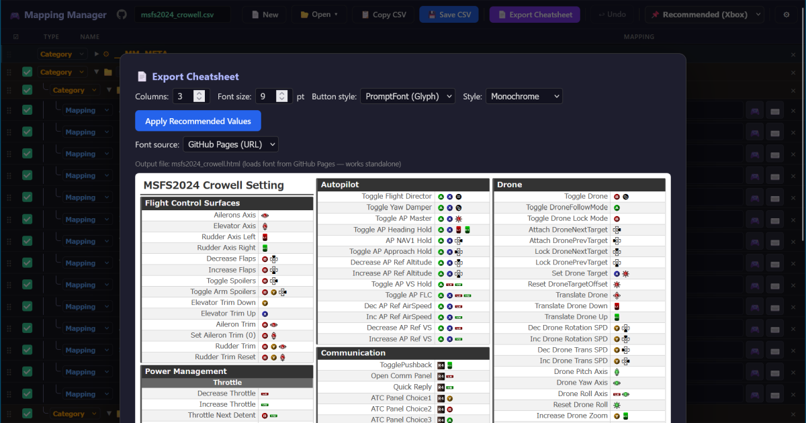

# Controller Mapping Cheatsheet Manager

コントローラーのボタンマッピングを管理し、チートシート形式のHTMLを出力するツールです。

ブラウザ上で動作する単体HTMLアプリケーションで、Python等の実行環境は不要です。

<!-- スクリーンショットがあればここに追加 -->
<!--  -->

## 主な機能

- **GUIでのマッピング編集** — カテゴリ・マッピング・セパレーター等をリストで管理
- **コントローラー直接入力** — Gamepad APIによるボタン入力で、同時押しを順番通りに記録
- **ドラッグ&ドロップ** — アイテムの並べ替え、カテゴリ間の移動
- **チートシート出力** — PromptFontを使ったボタンアイコン付きHTMLを生成（印刷・サブ画面表示用）
- **CSV入出力** — データをCSVファイルで保存・読み込み

## クイックスタート

1. [Releases](https://github.com/Crowell7144/ControllerMappingCheatSheetGenerator/releases) からZIPをダウンロードして展開
2. `cheatsheet-manager.html` をブラウザで開く
3. 「+ マッピング」「+ カテゴリ」ボタンでアイテムを追加
4. 🎮 アイコンをクリックしてコントローラーからボタンを入力、またはマッピング欄をクリックして文字列を直接編集
5. 「CSV保存」でデータを保存、「チートシート出力」でHTMLを出力

## ファイル構成

```
cheatsheet-manager.html  ← メインアプリケーション（ブラウザで開く）
promptfont.css           ← PromptFontスタイルシート（チートシート出力に必要）
promptfont.ttf           ← PromptFontフォント（チートシート出力に必要）
PromptFont_LICENSE.txt   ← PromptFontのライセンス
legacy/tsv2csv.py        ← 旧バージョン（v1）のファイル
```

## 使い方

### マッピングの編集

| 操作 | 説明 |
|------|------|
| マッピング欄をクリック | `[LB]+[A]+[B]` 形式でテキスト編集 |
| 🎮 アイコンをクリック | コントローラー入力待機モーダルを表示 |
| 右クリック | 挿入・移動・コピー・削除メニュー |
| ドラッグハンドル (⠿) | アイテムの並べ替え・カテゴリ間移動 |
| カテゴリの ▼/▶ | 子アイテムの折りたたみ |

### コントローラー入力モーダル

コントローラーを接続した状態で 🎮 アイコンをクリックすると、入力待機モーダルが開きます。

| キー | 動作 |
|------|------|
| Enter | 適用して閉じる |
| Space | 適用して次のマッピングへ |
| Tab | 変更せずに次のマッピングへ |
| Esc | キャンセル |

### キーボードショートカット

| ショートカット | 動作 |
|----------------|------|
| Ctrl + S | CSV保存 |
| Ctrl + Z | 元に戻す |
| Delete | 選択アイテムを削除 |

### チートシート出力

「チートシート出力」ボタンからHTMLを生成できます。

- カラム数（1〜4）とフォントサイズを指定可能
- 出力したHTMLは `promptfont.css` と `promptfont.ttf` と同じフォルダに配置してください

### マッピング文字列の書式

内部ではマッピングを `[ボタン名]` の `+` 区切りで管理します。

```
[LB]+[A]+[B]       ← LB, A, B の同時押し
[B]+[▲]             ← B + 十字キー上
[LS:XY]             ← 左スティック全方向
```

#### 認識するボタン文字列

```
A, B, X, Y
LB, RB, LT, RT
LS, LS:X, LS:Y, LS:XY
RS, RS:X, RS:Y, RS:XY
Start, Back
▲, ▼, ▶, ◀
▲▶, ▼▶, ◀▼, ◀▲  （方向キー斜め）
LP1, LP2            （エリコン左パドル）
RP1, RP2            （エリコン右パドル）
/                    （コントローラーアイコン）
```

### アイテム種類

| 種別 | 説明 |
|------|------|
| マッピング | ボタンと機能の対応を保持 |
| カテゴリ | グループ化用。ネスト可能 |
| セパレーター | 水平線による区切り |
| 改ページ | チートシート出力時に強制改ページ |
| 改カラム | チートシート出力時に強制カラム分割 |

## 旧バージョン（v1）からの移行

v1の TSVファイル（`paste.tsv` / `paste.txt`）は、`legacy/` フォルダ内の変換スクリプトで新形式のCSVに変換できます。

```bash
python tsv2csv.py paste.tsv
```

出力された `.csv` ファイルをマネージャーの「CSV読込」で開いてください。

変換スクリプトのオプション:

```bash
python tsv2csv.py paste.tsv -o output.csv    # 出力先を指定
```

## ライセンス

本プロジェクトのコードは [MIT License](LICENSE) の下で公開しています。

### PromptFont について

ボタンアイコンの表示に [PromptFont](https://shinmera.com/promptfont) を使用しています。

> PromptFont by Yukari "Shinmera" Hafner, available at https://shinmera.com/promptfont

PromptFont は [SIL Open Font License 1.1](PromptFont_LICENSE.txt) の下で提供されています。

本リポジトリを再配布する際は、`promptfont.ttf`、`promptfont.css` を含める場合、上記のライセンス表記と `PromptFont_LICENSE.txt` を必ず含めてください。
